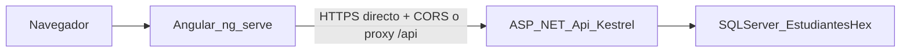

# Entorno local: backend + frontend + base de datos

Guía detallada para clonar, configurar y ejecutar la API **Servicios Estudiantes** (.NET 8), la base **SQL Server** y el portal **Angular 21** que la consume.

---

## Repositorios (enlaces remotos)

| Proyecto | Repositorio GitHub | Contenido principal |
|----------|-------------------|---------------------|
| **Backend** | [davidbarriosdnp/DOTNET_Servicios_Estudiantes_Hex](https://github.com/davidbarriosdnp/DOTNET_Servicios_Estudiantes_Hex) | Solución .NET: API, aplicación hexagonal, dominio, infraestructura SQL, scripts `Database/Scripts`, esta guía (`docs/ENTORNO_LOCAL.md`). |
| **Frontend** | [davidbarriosdnp/Angular_Sitio_Estudiante](https://github.com/davidbarriosdnp/Angular_Sitio_Estudiante) | Monorepo o raíz Angular; aplicación SPA en carpeta **`Angular_Sitio_Estudiantes`**. |

### Rutas típicas en disco (referencia local)

Ambos clones suelen vivir como carpetas **hermanas** bajo la misma carpeta de trabajo (por ejemplo `PROYECTOS`):

| Repo | Ejemplo de ruta |
|------|----------------|
| Backend | `<tu_ruta>/DOTNET_Servicios_Estudiantes_Hex` |
| Frontend | `<tu_ruta>/Angular_Sitio_Estudiante/Angular_Sitio_Estudiantes` |

Clonar:

```bash
git clone https://github.com/davidbarriosdnp/DOTNET_Servicios_Estudiantes_Hex.git
git clone https://github.com/davidbarriosdnp/Angular_Sitio_Estudiante.git
```

Documentación adicional en los repos: [README principal del API](../README.md), [README integración frontend](../README_FRONTEND.md), [README del proyecto Angular](https://github.com/davidbarriosdnp/Angular_Sitio_Estudiante/blob/main/Angular_Sitio_Estudiantes/README.md) (ruta dentro del repo: `Angular_Sitio_Estudiantes/README.md`).

---

## 1. Requisitos previos

| Herramienta | Notas |
|-------------|--------|
| **.NET SDK 8.x** | Misma versión mayor que `net8.0` del API (`Servicios_Estudiantes.Api.csproj`). Comprobar: `dotnet --version`. |
| **Node.js** | **20+** (README del front recomienda **22** alineado a CI). Comprobar: `node -v`. |
| **npm** | Incluido con Node; el front declara `packageManager`: **npm@11.6.1** en `package.json`. |
| **SQL Server** | Express, Developer o cualquier edición compatible (LocalDB si ajustas cadena). |
| **Cliente SQL** | **SSMS** o **`sqlcmd`** para ejecutar scripts. |

Opcional para el front: **`npx`** (viene con npm) si invocas el CLI Angular sin scripts npm.

---

## 2. Checklist rápido (orden de trabajo)

1. Crear BD y ejecutar scripts SQL en orden (**sección 3**).
2. Ajustar **`ConnectionStrings:Estudiantes`** (y opcionalmente **CORS** / **JWT**) en `Servicios_Estudiantes.Api/appsettings.Development.json` (**sección 4**).
3. En la raíz del backend: `dotnet restore` + `dotnet run` (**sección 5**).
4. En la carpeta `Angular_Sitio_Estudiantes`: `npm install` + `npm start` (o `start:proxy`) (**sección 6**).
5. Abrir navegador en el origen del **Angular** (típicamente `http://localhost:4200`) y el **Swagger** del API si lo necesitas (`https://localhost:7020/swagger`).

---

## 3. Base de datos

### Nombre de la base

- **`EstudiantesHex`** — creada por `Database/Scripts/00_CreateDatabase.sql` y referenciada como `Initial Catalog` en la cadena de conexión del API.

### Orden de scripts (instalación desde cero)

| Orden | Archivo | Propósito |
|-------|---------|-----------|
| 0 (opc.) | [`00_CreateDatabase.sql`](../Database/Scripts/00_CreateDatabase.sql) | Crea `EstudiantesHex` si no existe. |
| 1 | [`01_Tablas.sql`](../Database/Scripts/01_Tablas.sql) | Esquema: tablas dominio académico, `Usuario`, `RefreshToken`, etc. |
| 2 | [`02_Semillas.sql`](../Database/Scripts/02_Semillas.sql) | Datos iniciales + usuario **admin**. |
| 3 | [`03_Procedimientos.sql`](../Database/Scripts/03_Procedimientos.sql) | SP del dominio académico. |
| 4 | [`04_Usuarios_Auth.sql`](../Database/Scripts/04_Usuarios_Auth.sql) | SP de usuarios y refresh tokens. |

**Contexto obligatorio:** en **SSMS** selecciona la base **`EstudiantesHex`** antes de ejecutar `01`–`04`. Los scripts pueden no llevar `USE EstudiantesHex;` en todos los fragmentos.

**Ejemplo con `sqlcmd`** (adapta servidor y rutas):

```powershell
sqlcmd -S "localhost\SQLEXPRESS" -E -i "E:\...\DOTNET_Servicios_Estudiantes_Hex\Database\Scripts\00_CreateDatabase.sql"
sqlcmd -S "localhost\SQLEXPRESS" -E -d EstudiantesHex -i "E:\...\Database\Scripts\01_Tablas.sql"
sqlcmd -S "localhost\SQLEXPRESS" -E -d EstudiantesHex -i "E:\...\Database\Scripts\02_Semillas.sql"
sqlcmd -S "localhost\SQLEXPRESS" -E -d EstudiantesHex -i "E:\...\Database\Scripts\03_Procedimientos.sql"
sqlcmd -S "localhost\SQLEXPRESS" -E -d EstudiantesHex -i "E:\...\Database\Scripts\04_Usuarios_Auth.sql"
```

- `-E` = autenticación integrada de Windows. Con usuario SQL: usa `-U` / `-P` en lugar de `-E`.
- Sustituye `localhost\SQLEXPRESS` por tu instancia (`Data Source` de la cadena .NET).

### Migración incremental (`06`)

- [`06_MigracionEstudianteUsuarioId.sql`](../Database/Scripts/06_MigracionEstudianteUsuarioId.sql): solo si ya tenías una base antigua.
- Tras ejecutarlo, el script indica **volver a ejecutar `03_Procedimientos.sql` completo** para alinear SPs con el API actual.

---

## 4. Conexión backend ↔ SQL Server y configuración

### Cadena de conexión

- Archivo: `Servicios_Estudiantes.Api/appsettings.Development.json` → clave **`ConnectionStrings:Estudiantes`**.
- El valor **versionado en el repo es un ejemplo** (instancia y equipo concretos). Debes **sustituir** `Data Source` y el modo de autenticación según tu SQL Server.

### Variables de entorno (.NET)

Anidan la jerarquía JSON con **doble guion bajo**:

```powershell
# PowerShell (sesión actual)
$env:ConnectionStrings__Estudiantes = "Data Source=TU_SERVIDOR;Initial Catalog=EstudiantesHex;Integrated Security=True;TrustServerCertificate=True;"

# Luego, en la misma sesión:
dotnet run --project Servicios_Estudiantes.Api
```

### Otras claves relevantes (mismo `appsettings.Development.json`)

| Sección | Uso |
|---------|-----|
| **`Jwt`** | `Emisor`, `Audiencia`, `ClaveSecreta` (≥ 32 caracteres), tiempos de acceso y refresh. |
| **`Api:OrigenesCorsPermitidos`** | Orígenes permitidos del navegador (típ. `http://localhost:4200`, `https://localhost:4200`). |
| **`.env`** | El API carga `DotNetEnv` en `Program.cs`; puedes externalizar secretos en `.env` en la raíz del proyecto API (no subas secretos reales al control de versiones). |

---

## 5. Backend (.NET): comandos y URLs

**Directorio de trabajo:** raíz del repo `DOTNET_Servicios_Estudiantes_Hex` (donde está `Servicios_Estudiantes.sln`).

### Comandos principales

| Comando | Descripción |
|---------|-------------|
| `dotnet restore Servicios_Estudiantes.sln` | Descarga paquetes NuGet y restaura proyectos referenciados. |
| `dotnet build Servicios_Estudiantes.sln` | Compila la solución (modo Debug por defecto). |
| `dotnet build Servicios_Estudiantes.sln -c Release` | Compila en **Release**. |
| `dotnet run --project Servicios_Estudiantes.Api` | Arranca **Kestrel** con perfil por defecto de `launchSettings.json` (suele abrir Swagger). |
| `dotnet run --project Servicios_Estudiantes.Api --launch-profile http` | Solo **HTTP** (ver tabla de URLs más abajo). |
| `dotnet run --project Servicios_Estudiantes.Api --launch-profile https` | **HTTPS + HTTP** según `launchSettings.json`. |
| `dotnet test Servicios_Estudiantes.Pruebas/Servicios_Estudiantes.Pruebas.csproj` | Pruebas integración / xUnit (`WebApplicationFactory`). |

### URLs (desde [`launchSettings.json`](../Servicios_Estudiantes.Api/Properties/launchSettings.json))

| Perfil | URLs típicas |
|--------|----------------|
| **http** | `http://localhost:5045` |
| **https** | `https://localhost:7020` **y** `http://localhost:5045` |

- **Swagger UI:** `{base}/swagger` → por ejemplo `https://localhost:7020/swagger`.
- **API REST (versiónada):** prefijo **`/api/v1`** → ejemplo login: `POST https://localhost:7020/api/v1/Auth/login`.
- **Health (sin JWT, sin prefijo `/api`):** `GET /health`, `GET /health/live`.

### Docker (opcional, referencia del README del API)

```bash
docker build -t servicios-estudiantes-api .
docker run -p 8080:8080 -e ConnectionStrings__Estudiantes="..." -e Jwt__ClaveSecreta="..." servicios-estudiantes-api
```

---

## 6. Frontend (Angular): comandos y URL del API

**Directorio de trabajo:** `Angular_Sitio_Estudiante/Angular_Sitio_Estudiantes` dentro del repo [Angular_Sitio_Estudiante](https://github.com/davidbarriosdnp/Angular_Sitio_Estudiante).

### Instalación de dependencias

```bash
cd Angular_Sitio_Estudiantes
npm install
```

En CI reproducible usar **`npm ci`** (requiere `package-lock.json` presente).

### Scripts npm (`package.json`)

| Comando | Equivalente típico | Descripción |
|---------|---------------------|-------------|
| `npm start` | `ng serve` | **Configuración por defecto:** `serve` usa perfil **`local`** (`angular.json`) → suele cargar URLs desde **`environment.local.ts`** (`apiBaseUrl: https://localhost:7020`). |
| `npm run start:local` | `ng serve --configuration=local` | Igual que arriba, explícito. |
| `npm run start:dev` | `ng serve --configuration=development` | Sustituye entorno por **`environment.development.ts`**. |
| `npm run start:qa` | `ng serve --configuration=qa` | Entorno QA (edita URLs en `environment.qa.ts` si hace falta). |
| `npm run start:prod` | `ng serve --configuration=production` | Sirve usando build de producción (útil para comprobar optimización). |
| `npm run start:proxy` | `ng serve --configuration=proxy` | **`proxy.conf.json`** reenvía `/api` → `https://localhost:7020`; `environment.proxy.ts` suele tener **`apiBaseUrl` vacío** (peticiones relativas `/api/v1/...`). |
| `npm run build` | `ng build` | Build con configuración por defecto del proyecto (en `angular.json` suele ser **production**). |
| `npm run build:local` | `ng build --configuration=local` | Artefactos perfil **local**. |
| `npm run build:dev` | `ng build --configuration=development` | Artefactos **development**. |
| `npm run build:qa` | `ng build --configuration=qa` | Artefactos **qa**. |
| `npm run build:prod` | `ng build --configuration=production` | Artefactos **production**. |
| `npm run watch` | `ng build --watch --configuration=local` | Regeneración continua para integración/local. |
| `npm test` | `ng test` | Tests unitarios (config vitest/Karma según proyecto). |
| `npm run serve:ssr:Angular_Sitio_Estudiantes` | `node dist/.../server/server.mjs` | Tras un **build** con SSR; arranca servidor Node para pre-renderizado. |

### CLI Angular directo

Desde la misma carpeta del proyecto:

```bash
npx ng serve
npx ng serve --configuration=proxy
npx ng build --configuration=production
```

### Comunicación con el backend

- Las URLs se construyen como **`{apiBaseUrl}/api/v1/...`** cuando `apiBaseUrl` no está vacío (véase **`src/app/core/services/api-url.service.ts`** y **`src/environments/`**).
- **CORS:** si llamas desde el navegador a `https://localhost:7020`, el backend debe incluir tu origen (p. ej. `http://localhost:4200`) en **`Api:OrigenesCorsPermitidos`**.
- Si el certificado HTTPS del API molesta en el navegador, usa **`npm run start:proxy`**: el browser solo habla con el dev server (**puerto habitual 4200**); el proxy hace las peticiones al API.

Archivos útiles:

- [`proxy.conf.json`](https://github.com/davidbarriosdnp/Angular_Sitio_Estudiante/blob/main/Angular_Sitio_Estudiantes/proxy.conf.json)
- `src/environments/environment.local.ts`, `environment.development.ts`, `environment.proxy.ts`

---

## 7. Patrones de diseño y arquitectura — backend

Solución **[arquitectura hexagonal](https://github.com/davidbarriosdnp/DOTNET_Servicios_Estudiantes_Hex)** (puertos y adaptadores), con capas bien separadas.

| Idea | Implementación en el repo |
|------|---------------------------|
| **Hexagonal / clean** | **`Dominio`**: entidades y excepciones de dominio. **`Aplicacion`**: casos de uso, contratos (**puertos**), DTOs. **`Infraestructura`**: acceso datos SQL (**adaptadores**). **`Api`**: HTTP, seguridad, pipeline. |
| **CQRS ligero + MediatR** | Comandos y consultas como `IRequest<T>` / `IRequestHandler<,>` bajo [`Servicios_Estudiantes.Aplicacion/CasosUso`](../Servicios_Estudiantes.Aplicacion/). |
| **Puertos (interfaces)** | [`Puertos/IRepositorioAcademico.cs`](../Servicios_Estudiantes.Aplicacion/Puertos/IRepositorioAcademico.cs), [`Puertos/IRepositorioUsuarios.cs`](../Servicios_Estudiantes.Aplicacion/Puertos/IRepositorioUsuarios.cs), [`Puertos/IJwtListaNegra.cs`](../Servicios_Estudiantes.Aplicacion/Puertos/IJwtListaNegra.cs), [`Puertos/IGeneradorTokensJwt.cs`](../Servicios_Estudiantes.Aplicacion/Puertos/IGeneradorTokensJwt.cs). |
| **Adaptadores de persistencia** | [`RepositorioAcademicoSql`](../Servicios_Estudiantes.Infraestructura/AccesoDatos/RepositorioAcademicoSql.cs), [`RepositorioUsuariosSql`](../Servicios_Estudiantes.Infraestructura/AccesoDatos/RepositorioUsuariosSql.cs) ejecutan **procedimientos almacenados** (sin ORM sobre tablas dinámicas). |
| **Validación declarativa** | **FluentValidation** + pipeline **MediatR** [`ValidacionComportamiento`](../Servicios_Estudiantes.Aplicacion/Comportamientos/ValidacionComportamiento.cs). |
| **API mínima + versionado** | `Program.cs`, extensiones (`Extensiones/PipelineExtension`, mapeo de rutas), controladores agrupados bajo **`Controladores/V1`**. |
| **Respuesta unificada** | Envoltorio [`Respuesta<T>`](../Servicios_Estudiantes.Aplicacion/Envoltorios/Respuesta.cs) en JSON (camelCase), manejo centralizado en [`ManejadorErroresIntermediario`](../Servicios_Estudiantes.Api/Interceptores/ManejadorErroresIntermediario.cs). |
| **Seguridad** | JWT Bearer (HS256), refresh opaco en SQL, políticas de autorización (p. ej. administrador para `/Usuarios`), lista negra de `jti` en memoria ([`JwtListaNegraCachada`](../Servicios_Estudiantes.Api/Seguridad/JwtListaNegraCachada.cs)). |
| **Observabilidad** | Health checks; OpenTelemetry en extensiones (`ConfigurarTelemetriaDynatrace`, etc.). |

Persistencia exclusiva mediante **SQL Server** y **SPs** (consistencia con reglas de negocio en base).

---

## 8. Estructura de carpetas — backend

Relativa a la raíz **`DOTNET_Servicios_Estudiantes_Hex`**:

```
DOTNET_Servicios_Estudiantes_Hex/
├── Database/
│   └── Scripts/           # 00–04 (y 06 migración incremental)
├── docs/
│   └── ENTORNO_LOCAL.md    # Esta guía
├── Servicios_Estudiantes.Api/
│   ├── Controladores/V1/  # Auth, Estudiantes, Usuarios, catálogos…
│   ├── Configuraciones/   # JWT, DI del API
│   ├── Extensiones/       # Pipeline, Swagger, CORS…
│   ├── Interceptores/     # Errores, logging, buffering…
│   ├── Seguridad/         # Firma JWT, lista negra…
│   ├── Properties/launchSettings.json
│   ├── Program.cs
│   └── appsettings*.json
├── Servicios_Estudiantes.Aplicacion/
│   ├── CasosUso/          # Handlers MediatR (Autenticación, Estudiantes, Usuarios, Catalogos)
│   ├── Comportamientos/   # ValidacionComportamiento (pipeline)
│   ├── DTOs/
│   ├── Envoltorios/
│   ├── Puertos/
│   └── InyeccionDependencias/
├── Servicios_Estudiantes.Dominio/
│   ├── Entidades/
│   ├── Excepciones/
│   └── Enumeraciones/
├── Servicios_Estudiantes.Infraestructura/
│   └── AccesoDatos/       # RepositorioAcademicoSql, RepositorioUsuariosSql
├── Servicios_Estudiantes.Pruebas/
└── Servicios_Estudiantes.sln
```

---

## 9. Patrones de diseño y arquitectura — frontend

Proyecto en [Angular_Sitio_Estudiantes](https://github.com/davidbarriosdnp/Angular_Sitio_Estudiante/tree/main/Angular_Sitio_Estudiantes) dentro del repo Angular.

| Idea | Implementación típica en el código |
|------|-----------------------------------|
| **Componentes standalone** | Componentes cargados por ruta (`loadComponent` en rutas); sin NgModules obligatorios en muchas zonas. |
| **Organización por features** | Carpetas por dominio (`auth`, `estudiantes`, `inscripcion`, `usuarios`, `layout`, etc.). |
| **Enrutamiento y lazy loading** | [`app.routes.ts`](https://github.com/davidbarriosdnp/Angular_Sitio_Estudiante/blob/main/Angular_Sitio_Estudiantes/src/app/app.routes.ts) con `loadComponent`. |
| **Guards funcionales** | `authGuard`, `guestGuard`, `adminGuard`, `estudianteInscripcionGuard` en `src/app/core`. |
| **Interceptor HTTP** | [`auth.interceptor.ts`](https://github.com/davidbarriosdnp/Angular_Sitio_Estudiante/blob/main/Angular_Sitio_Estudiantes/src/app/core/auth.interceptor.ts): adjunta Bearer, excluye rutas públicas según configuración. |
| **Servicios y HttpClient** | Servicios por feature (`features/.../services`, `catalogos/*.service.ts`) consumen `Respuesta<T>` del API con **RxJS** (`Observable`, `finalize`, etc.). |
| **Estado de sesión** | [`AuthService`](https://github.com/davidbarriosdnp/Angular_Sitio_Estudiante/blob/main/Angular_Sitio_Estudiantes/src/app/features/auth/auth.service.ts) + almacenamiento local de tokens según política actual. |
| **Formularios** | Reactive Forms (`FormBuilder`) en páginas de login, registro, listas CRUD. |
| **UI** | **PrimeNG** (tablas, diálogos, menubar) + **SweetAlert2** (`AlertService`) para errores y confirmaciones. |
| **Sincronización de UI tras HTTP/async** | Utilidad [`sync-ui-after-http`](https://github.com/davidbarriosdnp/Angular_Sitio_Estudiante/blob/main/Angular_Sitio_Estudiantes/src/app/core/utils/sync-ui-after-http.ts) con `NgZone` + `ChangeDetectorRef` tras operaciones asíncronas y modales. |
| **SSR (opcional despliegue)** | Angular SSR + Express (`server.ts`, configuración `outputMode` en `angular.json`). |

---

## 10. Estructura de carpetas — frontend (`src/app`)

Ejemplo esperado dentro de **`Angular_Sitio_Estudiantes/src/app`**:

```
src/app/
├── app.config.ts           # Providers, HTTP client, interceptor
├── app.routes.ts           # Rutas principales + guards
├── core/
│   ├── admin.guard.ts
│   ├── auth.guard.ts
│   ├── auth.interceptor.ts
│   ├── estudiante-inscripcion.guard.ts
│   ├── guest.guard.ts
│   ├── models/
│   ├── services/           # api-url.service, alert.service…
│   ├── tokens/
│   └── utils/              # jwt-payload, sync-ui-after-http…
├── features/
│   ├── auth/               # login, registro, auth.service
│   ├── catalogos/          # programas-credito, materias, profesores (servicios)
│   ├── estudiantes/
│   ├── home/
│   ├── inscripcion/       # mi-inscripción
│   ├── layout/            # app-shell, menú
│   ├── materias/
│   ├── profesores/
│   ├── programas-credito/
│   └── usuarios/
└── environments/           # apiBaseUrl por perfil de build
```

---

## 11. Rutas del portal (Angular)

| Ruta | Acceso |
|------|--------|
| `/login`, `/registro` | Invitados (`guestGuard`). |
| `/inicio` | Autenticado. |
| `/estudiantes` | Autenticado (menú visible para todos los usuarios logueados). |
| `/mi-inscripcion` | Estudiante con permiso de inscripción (`estudianteInscripcionGuard`). |
| `/usuarios`, `/programas-credito`, `/materias`, `/profesores` | Solo administrador (`adminGuard`). |

> Muchos endpoints del API piden JWT; el portal **limita por rol** las pantallas administrativas. Detalle exhaustivo en el [README del API](../README.md).

---

## 12. Estudiante (autogestión) vs administrador de prueba

### Autogestión del estudiante

- **`/registro`** → `POST /api/v1/Auth/registro`.
- **`/login`** → `POST /api/v1/Auth/login`.
- **`/mi-inscripción`** → inscripción a tres materias según reglas de negocio (sin usar el CRUD administrativo).

### Administrador semilla (`02_Semillas.sql`)

| Campo | Valor |
|-------|--------|
| Nombre usuario | `admin` |
| Email | `admin@local.test` |
| Contraseña | `Admin123!` |
| Rol | **Administrador** |

Gestiona usuarios y catálogo desde el mismo portal; los estudiantes no ven esas opciones en el menú.

---

## 13. Reglas de negocio del dominio académico

(Resumen del [README](../README.md); validadas en aplicación + SP.)

1. **Registro en línea** con `POST /api/v1/Auth/registro`; respuesta tipo login con JWT (claim de estudiante si aplica).
2. **Programa de créditos** asociado a cada estudiante.
3. **Diez materias** en catálogo semilla del programa base.
4. **Cada materia = 3 créditos**.
5. **Máximo 3 materias** por estudiante; inscripción con tres IDs.
6. **Cinco profesores** en semilla; **dos materias** por profesor.
7. En una misma inscripción **no pueden repetirse profesores**.
8. **Directorio estudiantil** disponible para usuarios autenticados según endpoints documentados.
9. **Compañeros:** solo **nombres** (`string[]`).

### Autorización

- **`/api/v1/Usuarios`:** rol **Administrador**.
- **`/api/v1/Auth`:** público `programas`, `registro`, `login`, `refresh`; `logout` con JWT.

---

## 14. Diagrama de flujo (local)



---

## 15. Referencias cruzadas

| Documento | Enlace |
|-----------|--------|
| README API | [README.md](../README.md) |
| Integración cliente | [README_FRONTEND.md](../README_FRONTEND.md) |
| README Angular (scripts, proxy, Docker) | Repo [Angular_Sitio_Estudiantes/README.md](https://github.com/davidbarriosdnp/Angular_Sitio_Estudiante/blob/main/Angular_Sitio_Estudiantes/README.md) |

Si trabajas con copias locales de los repos sin GitHub online, sustituye los enlaces `https://github.com/...` por tus rutas de disco o servidor interno.
